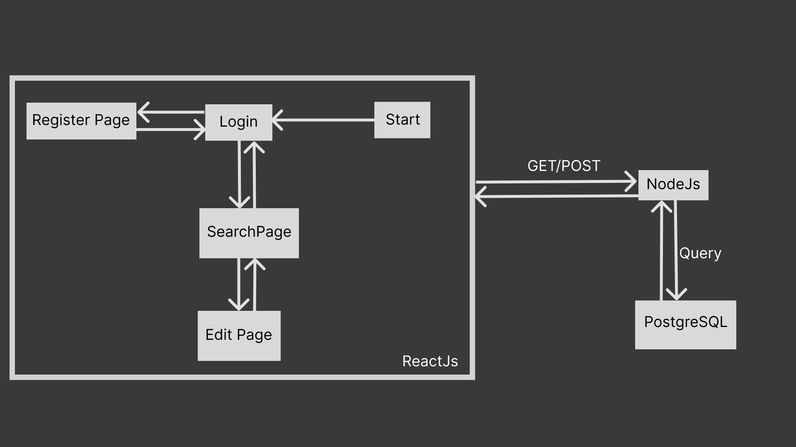

# Hi, I'm Abhishek Zade! 👋


## 🚀 About Me
I am a fresher looking for an SDE. I am a Google Summer of Code 2021 participant having skills in Web-Development, and Machine learning also worked on various projects such as MQTT servers using Flutter.


# Gardians web-App 

This Code Base consists Demo version of Gaurdian App

TechStack
* Frontend -> ReactJs
* Backend  -> NodeJs
* DataBase -> Postgress

### Basic Architecture


### Video
(https://drive.google.com/file/d/1PC6gfR_oEiYoUHU0GoGVBGASKfwQ-BYz/view?usp=sharing)

#### Login Page
The User will Route to Login Where user will have Two option Login or Register.

Login uses Post request to backend.

Query used to retrive DataBase

```bash

app.post('/login', (req, response) => {
        response.header("Access-Control-Allow-Origin", "*");
        const query = req.body.body;
        const email = query.email;
        const password = query.password;
        client.query(`SELECT * FROM userdetails WHERE "Email" = $1 AND "Password" = $2`, [email, password], (err, res) => {
            if (!err) {
                if (res.rows.length === 0) response.send('No user Found');
                else response.send(res.rows);
            } else console.log(err.message), response.send(err.message);
        });
    })
```


#### Register Page

If user select to register User will be represented by Details Form. 

* If user exists Return 
* Else Register User

```bash
       app.post('/register', (req, response) => {
        response.header("Access-Control-Allow-Origin", "*");
        const query = req.body.body;
        let email = query.email;
        let password = query.password;
        client.query(`SELECT * FROM userdetails WHERE "Email" = $1 AND "Password" = $2`, [email, password], (err, res) => {
            if (!err) {
                if (res.rows.length !== 0) {
                    response.send("Already a User");
                    return;
                }
            } else console.log(err.message), response.send(err.message);
        });
        email = `${query.email}`;
        password = `${query.password}`;
        let FirstName = `${query.firstName}`;
        let LastName = `${query.lastName}`;
        let phoneNo = `${query.phoneNo}`;
        let medicaCon = `${query.medicalCondition}`;
        let medicine = `${query.medicines}`;
        let emergncyCo = `${query.emergencyContact}`;
        client.query(`INSERT INTO "userdetails" VALUES ($1,$2,$3,$4,$5,$6,$7,$8)`, [FirstName, LastName, email, phoneNo, medicaCon, medicine, emergncyCo, password], (err, res) => {
            if (!err) {
                response.send("SuccessFull Submited");
            } else console.log(err.message), response.send(err.message);
        });
    })

```

#### Search Page
User are able to search using two Parameter 
* Using Name
* Using Area
* or Both

Backend

##### Here GET request is Since retriving data is important here

```bash
 app.get('/', (req, reactResponse) => {
        reactResponse.header("Access-Control-Allow-Origin", "*");
        const query = req.query;

        //  search for all data without parameter
        if (query.search === '' && query.area === 'All') {
            client.query('SELECT * FROM hospital', (err, res) => {
                if (!err) reactResponse.send(res.rows)
                else console.log(err.message), reactResponse.send(err.message);
            });
        }

        // Search for all data with paramter
        if (query.search.length >= 1 && query.area === 'All') {
            let q = `${query.search}%`;
            client.query(`SELECT * FROM hospital WHERE "Name" LIKE $1`, [q], (err, res) => {
                if (!err) reactResponse.send(res.rows)
                else console.log(err.message), reactResponse.send(err.message);
            });
        }


        // Search for select region with parameter
        if (query.search.length >= 1 && query.area !== 'All') {
            let q = `${query.search}%`;
            let a = `${query.area}`;
            client.query(`SELECT * FROM hospital WHERE "Name" LIKE $1 AND "Area" = $2`, [q, a], (err, res) => {
                if (!err) reactResponse.send(res.rows)
                else console.log(err.message), reactResponse.send(err.message);
            });
        }


        // search for selected region without parameter
        if (query.search === '' && query.area !== 'All') {
            let a = `${query.area}`;
            client.query(`SELECT * FROM hospital WHERE "Area" = $1`, [a], (err, res) => {
                if (!err) reactResponse.send(res.rows)
                else console.log(err.message), reactResponse.send(err.message);
            });
        }

    })
```

#### Edit Page
From searcg Page user can route to Edit user details by clicking on user name.
User will represented by Form to Edit.

backend
```bash
app.post('/details/change', (req, reactResponse) => {
        reactResponse.header("Access-Control-Allow-Origin", "*");
        let query = req.body.params;
        let email = query.email;
        let password = query.password;
        let firstName = query.firstName;
        let lastName = query.lastName;
        let phoneNo = query.phoneNo;
        let emergency = query.emergency;
        client.query(`UPDATE "userdetails"
        SET "FirstName" = $1, "LastName"=$2,"PhoneNo"=$3,"EmergencyCo"=$4
        WHERE "Email" = $5AND "Password" = $6`, [firstName, lastName, phoneNo, emergency, email, password], (err, res) => {
            if (!err) reactResponse.send(res)
            else console.log(err.message), reactResponse.send(err.message);
        });
    })
```


